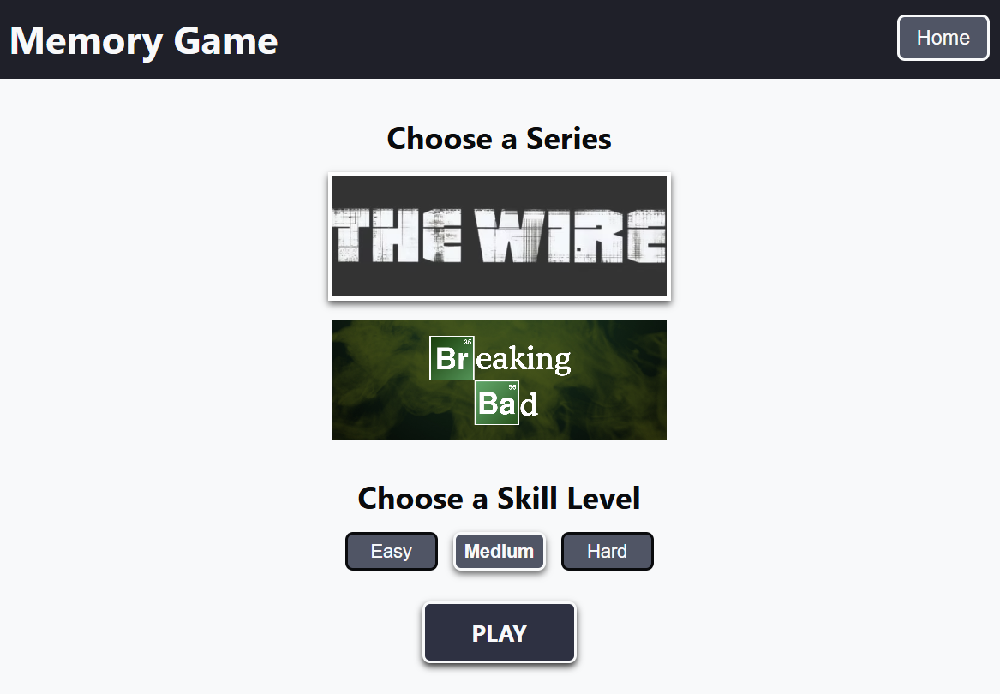
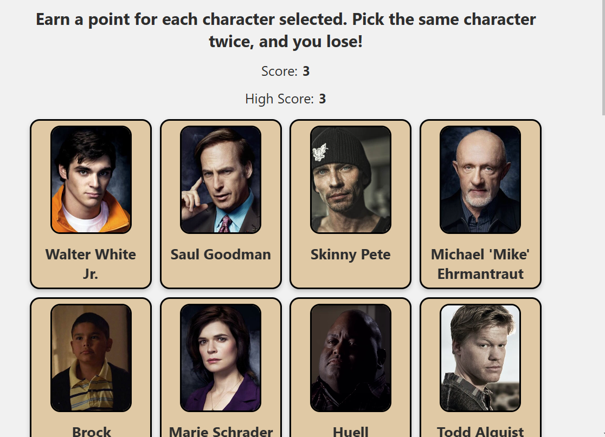
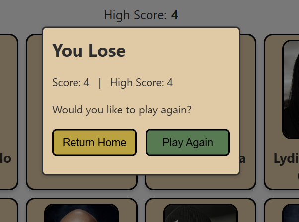

# Memory Card Game: 

This is a memory card game featuring characters from famous TV series 'The Wire' and 'Breaking Bad.' Users are challenged to select as many unique characters as possible without selecting the same one twice, with each successful selection adding to the user's score.

## Live Demo

https://memory-game-sable-seven.vercel.app/play

## Technologies

- **React 18**
- **TypeScript**
- **React Router v6**

## Features

### 🏠 Home Page (Game Setup)

- Home page enabling user to select between a game based on 'The Wire' or 'Breaking Bad'
- User can also select the difficulty rating, which affects how many characters will be in the game

*Home Page with Game Configuration*

### 🛍️ Gameplay

- User selects character card, triggering a shuffle event that reorders the cards
  - Each unique character selected contributes to the user's score (tracked at top of page)

*Game Page with Show Character Cards*

- If a user selects the same character twice, they lose, and receive the option to play again or return to the Home Page

*Modal with Options to Play Again or Return Home*
 
## Contact Information

For questions, suggestions, or feedback, please contact me at:

-Email: nickmufson1@gmail.com
-LinkedIn: linkedin.com/in/nicholasmufson
